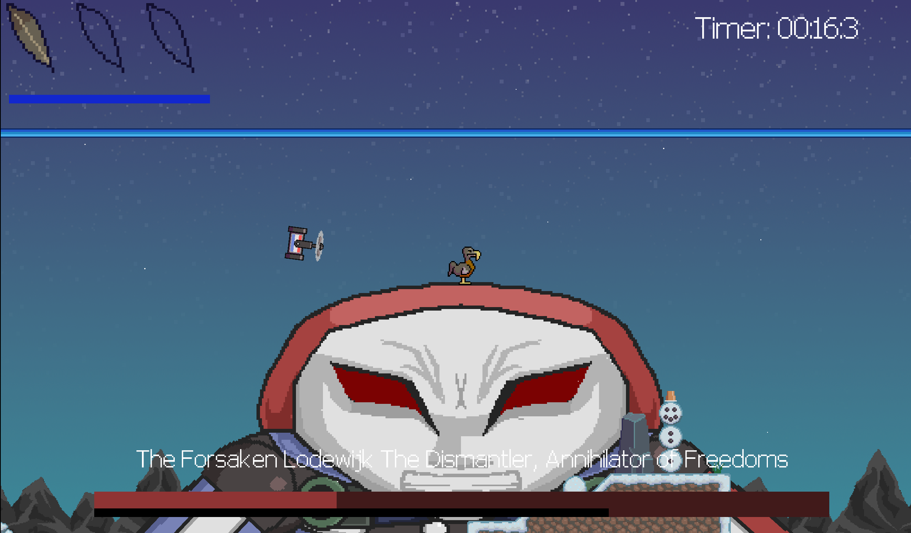
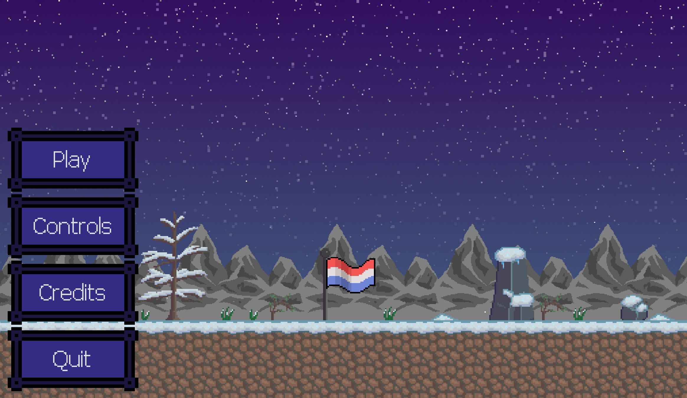
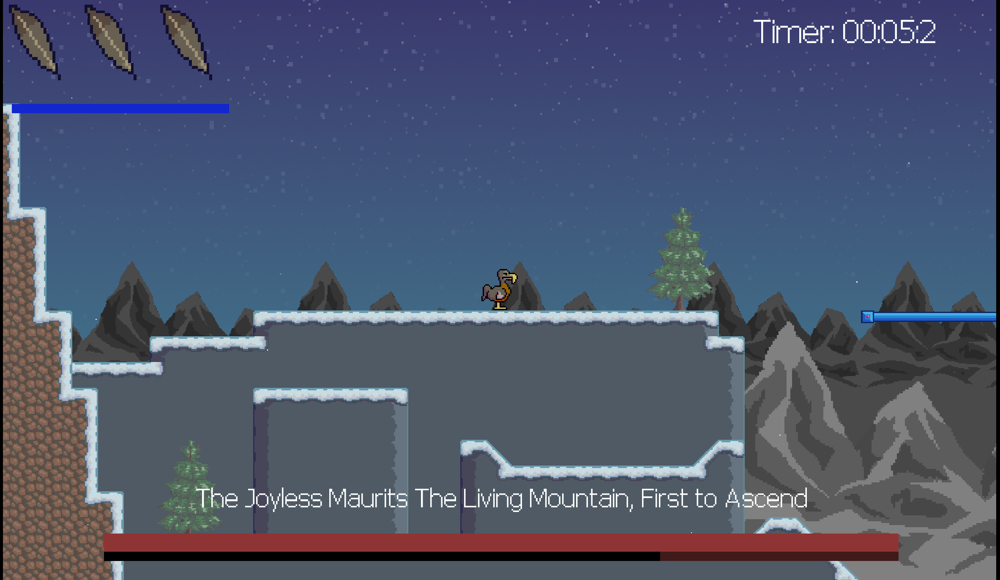
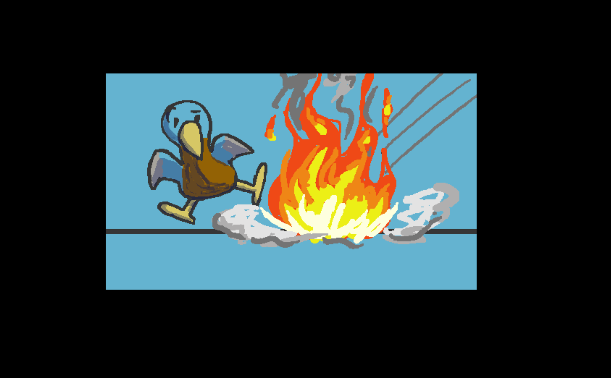
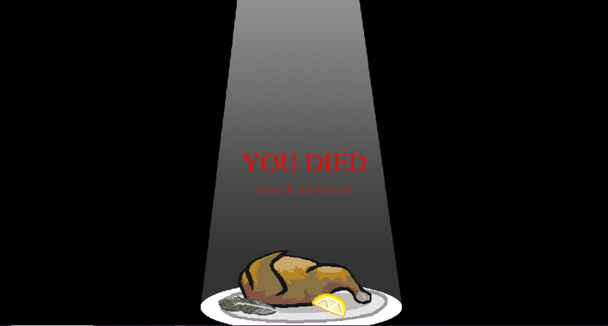

# The Last Dodo

The Dutch Killer Robot is coming for you, the last dodo. You must dash to survive!

## About

Destroy the robot by using rocket and attacking it's control center!

## Controls

* Arrow keys to move
* Shift to **dash**

## Screenshots 📷

## About 🔴

A game made for the Games Den Quick 2021 Game Jam

## Engine ⚙️

Made with Godot :heart: 

## Team 👨‍👨‍👦‍👦

* Boris - programmer
* Sam - artist
* Andrew - wildcard (UI + drone AI)
* Hiémal - sound/music
* Shahzam - designer

## License 📜

 
